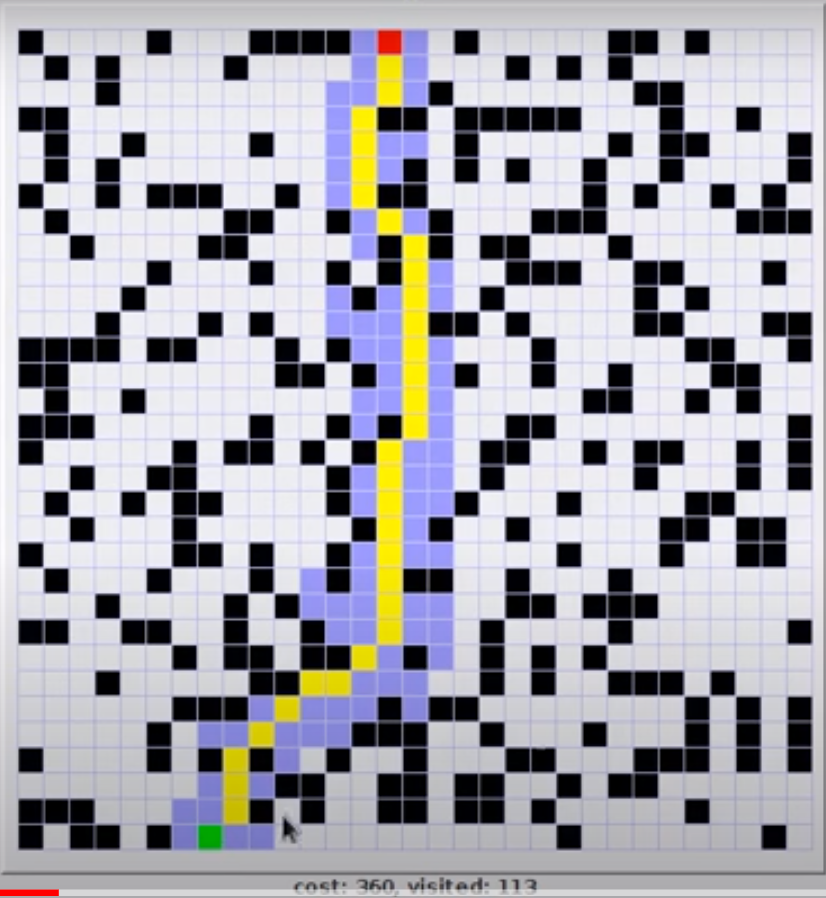

# A* Algorithm Implementation in JavaScript

This repository contains a JavaScript implementation of the A* (A-Star) algorithm for pathfinding in a grid. The code is structured to find the shortest path from a given start cell to an end cell while considering blocked cells and using the Manhattan distance heuristic.

## Algorithm Overview

A* is a widely used pathfinding algorithm that combines Dijkstra's algorithm with a heuristic search. It efficiently explores nodes based on their estimated total cost, making it suitable for finding solutions in various grid-based scenarios.
It avoids paths going away from the goal by considering blocked cells and using the Manhattan distance heuristic.Hence this algorithm is considered to have its own brain.


## Implementation

Our JavaScript implementation of the A* algorithm is designed for grid-based pathfinding. Key components of our implementation include:

- **Cell and Node Structures:** We define structures to represent cells and nodes in the grid.

- **Heuristic Function:** We calculate the Manhattan distance heuristic to estimate the cost to reach the goal.

- **Grid Validation:** Functions to check if a cell is valid (within grid bounds) and if it's blocked.

- **A* Search:** The main A* algorithm logic for finding the shortest path.

## Usage

Using our A* algorithm implementation is straightforward. Here's a simple example using a grid:


## Comparison



<!-- 
```javascript
// Define the dimensions of the grid
const ROWS = 4;
const COLS = 4;

// ... (rest of your code)

const grid = [
    [1, 0, 1, 1],
    [0, 0, 0, 1],
    [1, 0, 1, 0],
    [1, 0, 0, 0]
];

const start = new Cell(0, 0);
const end = new Cell(3, 3);

const path = aStar(grid, start, end);

if (path !== null) {
    console.log("Path exists using A* algorithm:");
    for (let i = 0; i < path.length; i++) {
        console.log(`(${path[i].x}, ${path[i].y})`);
    }
} else {
    console.log("No path exists using A* algorithm.");
} -->


